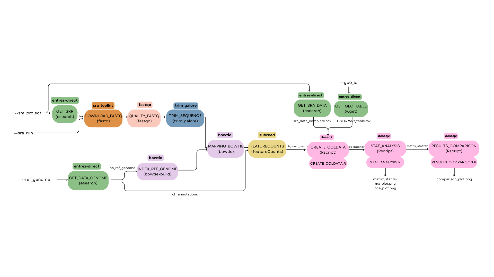

# ReproHackathon - RNA-Seq Analysis of Staphylococcus aureus persisters

## Project Description

This project is part of a **ReproHackathon** aiming to reproduce the RNA-Seq analysis from the article:

> **"Intracellular Staphylococcus aureus persisters upon antibiotic exposure"**  
> *Nature Communications* (2020) 11:2200  
> DOI: [10.1038/s41467-020-15966-7](https://doi.org/10.1038/s41467-020-15966-7)

Analysing RNA-Seq data to identify differentially expressed genes in intracellular persister cells of *Staphylococcus aureus* after antibiotic treatment.

This is the result of a course from the AMI2B master's program at Paris-Saclay University.

## Biological Context

Bacterial **persisters** are phenotypic variants that:
- Enter a **transient non-dividing state**
- Develop **antibiotic tolerance**
- Contribute to **chronic infections** and **therapeutic failures**
- Constitute a **reservoir for relapses**

## RNA-Seq Analysis Pipeline Overview

The workflow is implemented using Nextflow and encapsulated in Docker containers to ensure reproducibility. It includes:
* Retrieval of SRA sequencing data
* Quality trimming of reads
* Reference genome preparation and indexing
* Read alignment with Bowtie
* Gene-level quantification with featureCounts
* Differential expression analysis with DESeq2
* Annotation of differentially expressed genes using AureoWiki and KEGG resources



## Installation and Execution
    
### Prerequisites

The pipeline is designed to run on a virtual machine with **Docker, Nextflow and Java** running.

### Execution

Once on the VM, please run these commands to start the process.

```
cd /home/ubuntu/data/mydatalocal
git clone https://github.com/Reprohackathon-RNASeq/Reprohackathon-RNASeq.git
cd Reprohackathon-RNASeq/RNASeqanalysis
chmod +x run.sh
./run.sh
```
### Parameters
The pipeline provides several configurable parameters to customize the analysis.

--test true can be used to download only the first 10,000 reads for quick testing. 

--threads sets the number of cores to be used (default: 1 core, except 3 for DOWNLOAD_FASTQ, FEATURE_COUNTS and MAPPING_BOWTIE and 2 for INDEX_REF_GENOME). Users can specify either a single SRA run (--sra_run SRRXXXX) or a full SRA project (--sra_project SRPXXXX) to download data. 

The pipeline also requires a reference genome (--ref_genome) and a GEO dataset ID (--geo_id). 

By default, run.sh executes:

```
nextflow run main.nf --sra_project SRP227811 --ref_genome CP000253.1 --geo_id GSE139659
```
## Contributors

Tom BELLIVIER
Tom GORTANA
Marie MEIER
Donatien WALLAERT
